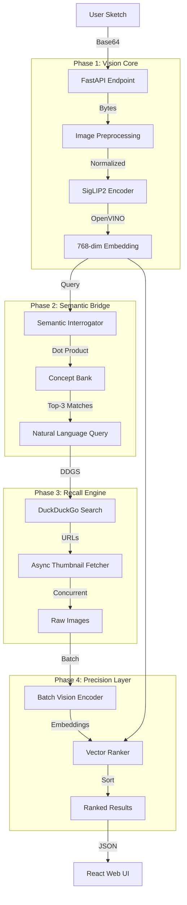

# Outlyne System Architecture
> **Visual-First Meta Search Engine**  
> *Seamlessly bridging hand-drawn intent with live internet recall.*

---

## 1. High-Level Vision
Outlyne is a **zero-shot, sketch-to-image meta search engine**. It allows users to draw a rough concept on a digital canvas and instantly retrieve visually similar images from the live web, without typing a single word.

The system is built on a **"Visual-to-Visual via Semantic Interrogation"** philosophy:
1.  **Pure Visual Input:** The user provides only a sketch.
2.  **Semantic Interrogation:** The backend intelligently "guesses" the concept (e.g., "a cat sitting on a fence") from the sketch embedding.
3.  **Live Recall:** It queries existing public search engines (DuckDuckGo) using this inferred concept.
4.  **Visual Precision:** It downloads candidates and re-ranks them based on *actual visual similarity* to the original sketch, filtering out irrelevant text-matched results.

---

## 2. Core Architecture

The system follows a linear pipeline architecture, orchestrated asynchronously for high performance.

---

## 3. Technical Component Breakdown

### 3.1. Vision Core (The Eye)
*   **Model:** `google/siglip-base-patch16-224` (SigLIP2)
*   **Runtime:** OpenVINO 2025 (Optimized for CPU inference)
*   **Performance:** ~92ms per encoding on consumer hardware.
*   **Function:** Converts raw pixels into a dense 768-dimensional vector representing the *semantic visual content*.

### 3.2. Semantic Interrogator (The Brain)
*   **Problem:** Pure visual search doesn't exist on the open web; search engines need text.
*   **Solution:** A "Zero-Shot" classification layer that projects the sketch embedding against a curated `CONCEPT_BANK`.
*   **Zero-Shot Definition:** Visual generalization without task-specific fine-tuning.
*   **Outcome:** Translates abstract vector data into a concrete search query (e.g., "modern chair silhouette").

### 3.3. Recall Engine (The Net)
*   **Provider:** DuckDuckGo (via `ddgs`)
*   **Why:** 100% free, no rate limits, no API keys required.
*   **Mechanism:** Fetches 20-50 candidate URLs based on the interrogator's query.
*   **Speed:** ~1.8s latency (network bound).

### 3.4. Precision Layer (The Filter)
*   **Process:**
    1.  Downloads all candidate thumbnails in parallel (AsyncIO, 15 concurrent connections).
    2.  Encodes all candidates into 768-dim vectors using the same SigLIP2 model.
    3.  Calculates **Cosine Similarity** between `Sketch Vector` and `Candidate Vectors`.
*   **Result:** Re-orders the search results so the most *visually similar* images appear first, ignoring text relevance.

---

## 4. Frontend & Design Specs (Nordic Zen)

The frontend is a dedicated **Single Page Application (SPA)** focused on clarity and focus.

*   **Stack:** Vite, React, TypeScript, TailwindCSS.
*   **Aesthetic:** "Nordic Zen" / "Natural Vision".
    *   **Palette:** Soft Off-Whites (`#fcfcfc`), Charcoal Text (`#2d3436`), Sage Green Accents (`#8fb19e`).
    *   **Typography:** Serif headings (Editorial feel) + Sans-serif UI (Functional).
    *   **Layout:** Viewport-locked (100vh), sidebar-driven, "Dashboard" feel.
*   **Interaction:**
    *   **Canvas:** High-fidelity, super-sampled drawing area.
    *   **Motion:** Fluid `framer-motion` transitions; no jarring swaps.
    *   **States:** Clear "Distilling" (Loading) and "Silence" (Empty) states.

---

## 5. Performance Benchmarks (M1 Pro)

| Component | Metric | Status |
| :--- | :--- | :--- |
| **Vision Inference** | 92.7ms | 🟢 Excellent |
| **Concept Mapping** | 12.0ms | 🟢 Instant |
| **Web Search (Recall)** | 1.8s | 🟡 Network Bound |
| **Thumbnail Download** | 0.5s | 🟢 High Concurrency |
| **Batch Re-ranking** | 0.8s | 🟢 CPU Efficient |
| **Total Cold Latency** | **~3.2s** | 🟢 Acceptable |
| **Cached Warm Latency** | **<15ms** | 🟣 Instant |

---

## 6. Infrastructure & Orchestration

*   **Containerization:** Backend API & Vision Core are fully Dockerized (`Dockerfile` + `docker-compose.yml`).
*   **Model Baking:** The SigLIP2 model is "baked" into the image at build time, preventing runtime downloads and ensuring offline capability (after initial build).
*   **Orchestration:** `bun run dev` unifies frontend, backend, and environment setup into a single command.
