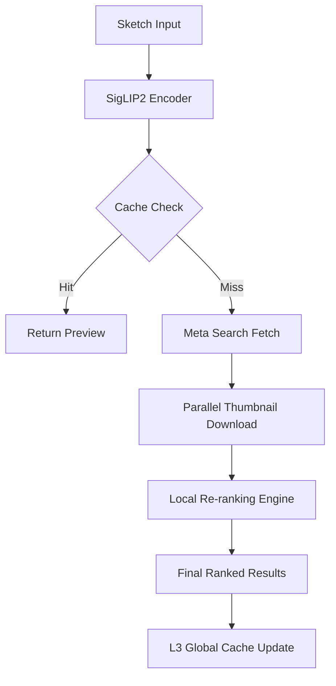

# Outlyne: AI-Powered Sketch-to-Image Meta Search
> **Project Blueprint**  
> *Real-time visual intelligence meets live internet recall.*

---

## Project Aim
Build a live, lightweight sketch-to-image meta search engine where a user draws a sketch, the system converts it into a visual embedding in real-time, fetches candidate images live from public image search engines, and re-ranks them locally.

**Core Philosophy:**
- **No Local Indexing:** Stay lightweight by leveraging existing search engines.
- **CPU-First:** High-performance inference on consumer hardware via advanced quantization.
- **Sub-second Perceived Latency:** Aggressive caching and parallelized execution to minimize waiting time.

---

## Core Idea
> **"Do not own the index. Orchestrate the intelligence."**  
> Use existing image search engines for Recall, then apply sketch-aware visual intelligence locally for Precision.

---

## Scope & Constraints

### Included
- **Live Sketch → Embedding:** Instant conversion via SigLIP2 or DINOv2.
- **Dynamic Meta-Search:** Real-time fetching from Bing/Google/SerpAPI.
- **Local Re-ranking:** Advanced cosine similarity on thumbnail batches.
- **Tiered Caching:** Multi-layer (L1 In-Memory, L2 Disk, L3 URL-based).
- **Proactive UI:** Modern, responsive canvas interface.

### Excluded
- Local image datasets or permanent indexing.
- Heavy web crawling or scraping.
- LLMs or RAG (keep it focused on visual similarity).
- GPU-only models (everything must run on CPU).

---

## Tech Stack (2026 Optimized)

### Vision & Inference
- **Vision Encoder:** SigLIP2-Base or DINOv2-Small (Superior to CLIP for visual perception).
- **Inference Runtime:** OpenVINO Toolkit (for Intel CPUs) or ONNX Runtime with INT8 Quantization.
- **Vector Math:** NumPy/PyTorch for flat re-ranking (FAISS for scaling if candidate count exceeds 1k).

### Meta Search & Data
- **Engines:** Bing Image Search API, SerpAPI, or Brave Search API.
- **Protocol:** HTTPX (Async Python) for concurrent API requests.
- **Metadata:** Schema.org (JSON-LD) enrichment (best-effort) for secondary ranking signals.

### Backend (The Orchestrator)
- **Framework:** FastAPI (Python 3.12+) — Asynchronous and type-safe.
- **Caching:** Redis (L2) + cachetools (L1 LRU) with content-addressable keys.
- **Concurrency:** TaskGroups for simultaneous search and thumbnail pre-encoding.

### Frontend (The Experience)
- **Framework:** Vite + React (SPA) — Instant HMR and zero SSR overhead.
- **Styling:** Vanilla CSS (Glassmorphism + Modern Gradients).
- **Canvas Engine:** Konva.js or Native Canvas + Perfect Freehand.

---

## High-Level Architecture

---

## 2026 Caching Strategy: "The Triple Threat"

### 1: Sketch Cache (Memory)
- **Key:** BLAKE3(normalized_sketch_bits)
- **TTL:** 10 Minutes.
- **Purpose:** Instant feedback for iterative sketching.

### 2: Meta-Recall Cache (Redis)
- **Key:** SHA256(interpreted_query_params)
- **TTL:** 1 Hour.
- **Purpose:** Avoid redundant and expensive API calls to search engines.

### 3: Feature Cache (Content-Addressed)
- **Key:** image_url_hash
- **Value:** Pre-computed vector_embedding.
- **TTL:** 24 Hours.
- **Purpose:** Skip re-encoding thumbnails across different user sessions.

---

## Implementation Phases

### Phase 1: The Vision Core [COMPLETED]
- [x] Integrate SigLIP2 and optimize with OpenVINO.
- [x] Implement `normalize_sketch()` for line-width and contrast stabilization.
- [x] Containerize with Docker and OpenVINO "bakery" for 2s cold starts.
- [x] **Deliverable:** VisualEmbedder module passing bench tests + Dockerized API.

### Phase 2: The Recall Engine [COMPLETED]
- [x] Research and select best free image search API (DuckDuckGo via `ddgs`)
- [x] Implement BaseSearchAdapter abstract class for extensibility
- [x] Build DuckDuckGoAdapter with the `ddgs` library (100% free, no limits)
- [x] Create async thumbnail downloader with concurrency control
- [x] Verify end-to-end search → download pipeline
- [x] Integrate search into FastAPI endpoint via SearchOrchestrator
- **Deliverable:** ✅ MetaSearchClient capable of fetching 20 results in ~3s (search + download).

### Phase 3: The Precision Layer [COMPLETED]
- [x] Build the Local Re-ranker using dot product (equivalent to cosine for L2-normalized embeddings)
- [x] Implement batch encoding for incoming thumbnails
- [x] Create SearchOrchestrator to tie Vision Core + Recall + Precision
- [x] Add `/search` FastAPI endpoint accepting base64 sketches
- [x] Verify end-to-end pipeline with test (61.3% top similarity score)
- **Deliverable:** ✅ Ranked image results endpoint with similarity scores.

### Phase 4: Premium UI/UX
- Build Vite-based frontend with a high-performance drawing canvas.
- Implement "Search-as-you-draw" (debounced inference).
- **Deliverable:** Smooth, production-ready static web application.

---

## Performance Targets
- **E2E Latency:** < 800ms (Cold), < 200ms (Cached).
- **CPU Load:** < 40% on 4-core M1/i5 equivalent.
- **RAM Footprint:** < 450 MB (Runtime + Model Weights).
- **API Efficiency:** > 80% Cache hit rate for frequent categories.

---

## Final Deliverables
- [ ] **Outlyne Core:** FastAPI background service.
- [ ] **Outlyne Web:** Vite-based reactive dashboard (SPA).
- [ ] **Quantized Models:** Optimized .onnx or .xml weights.
- [ ] **Deployment Kit:** Docker Compose for horizontal scaling.
